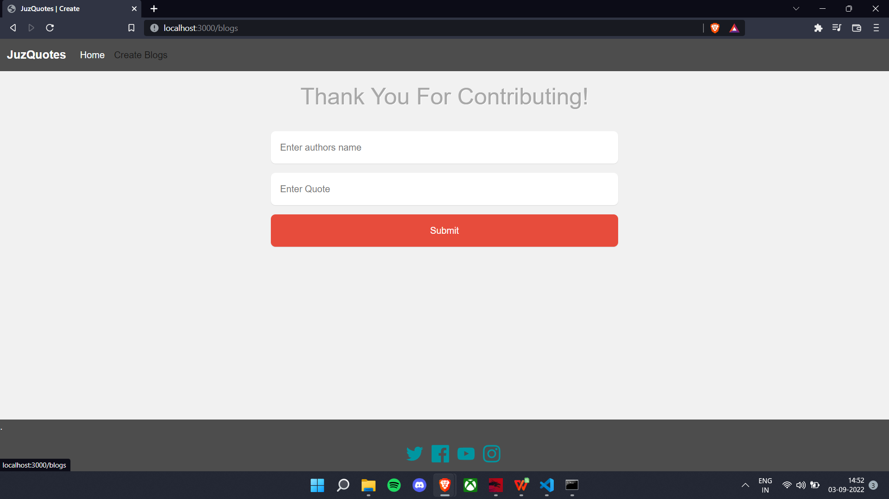

# JuzQuotes
A dynamic webpage created using node.js and mongodb as backend
<h2>HomePage</h2>
<<<<<<< HEAD

<h2>Add new Quote Page</h2>

=======

<h2>Create Quote Page</h2>

>>>>>>> 2407d61816be40dbe4537d4360dd14d1a188e394
